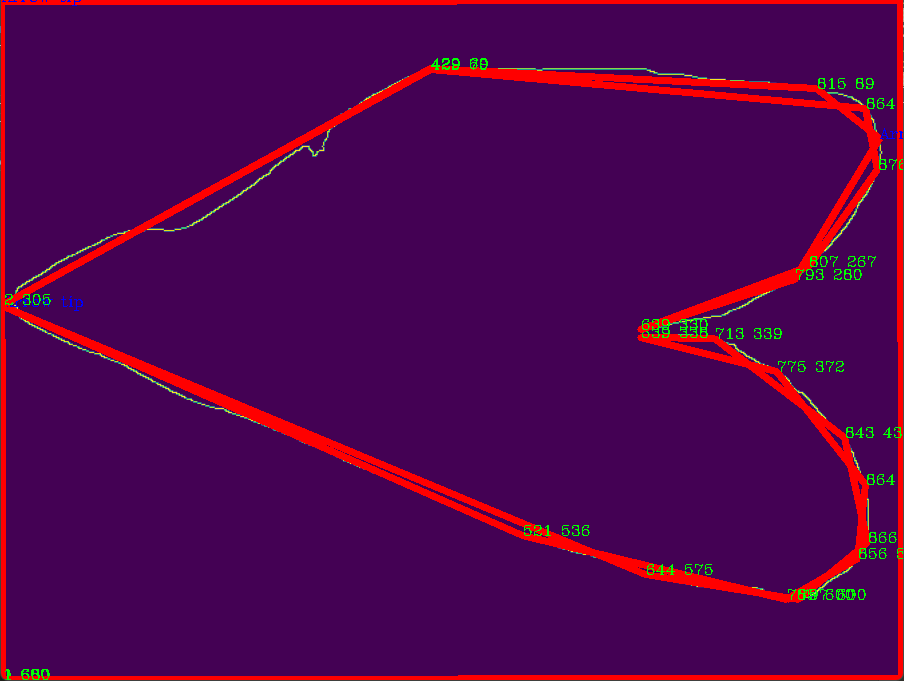

# Current Code

## Basic Info

All images are found in the `images` folder
Most of these images where taken as screenshots from the result of the individual python program
each program is run in a separate, and input is hardcoded into each program
Methods for saving these images still needs to be found

## Description
This is currently how this code works
Images are found below

Begin with `img.jpg` [^1]

use with `foreground.py`
output gained from this is `img_foreground.png`

use `foreground_img.png` at `edge.py`
output gained from this is `img_edge.png`

use `img_edge.png` at `contour_co-ordinates.py`
final output gained is `img_contours.png`

## Other

Items below are found in the `depreciated` folder, and are currently not being used

| Items |
| ----------- |
| `x_edit_img` is an edited version of `img`   1: Hand has been edited out because better pictures will be taken in the future where hand is not present anymore |
| `x_planning.png` is not currently being used and is a part of `main.py` |
| `x_main.py` is not currently being used |
\ `filter_img.png` is the result gained from `main.py` |

## Images

#### Img.jpg
  

#### Foreground.png
  

#### Edge.png
  

#### Contours.png
  

## Important Links

All code was found under --> [GeeksforGeeks](https://www.geeksforgeeks.org/opencv-python-tutorial/)
Easy Markdown --> [Markdown Cheat Sheet](https://www.markdownguide.org/cheat-sheet/)

