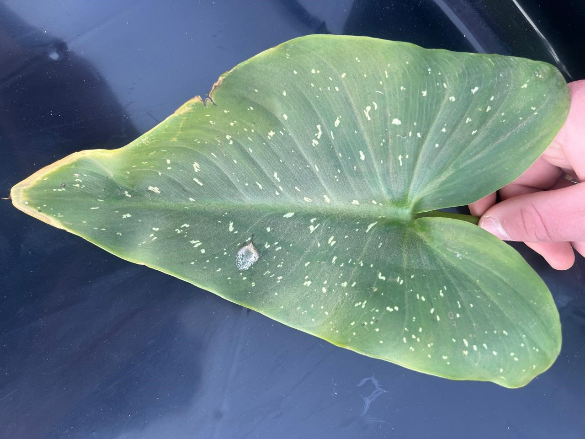
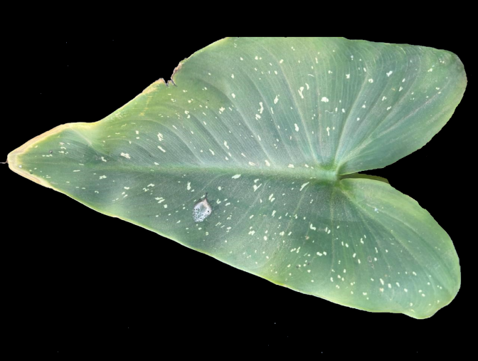
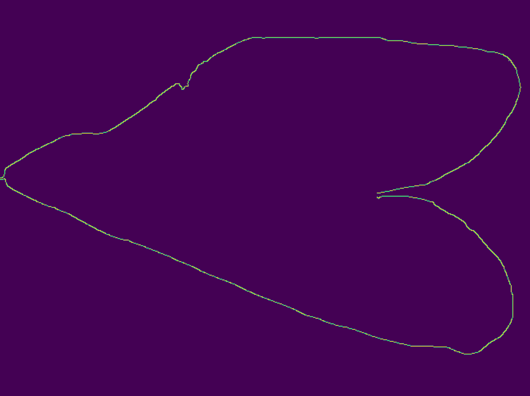
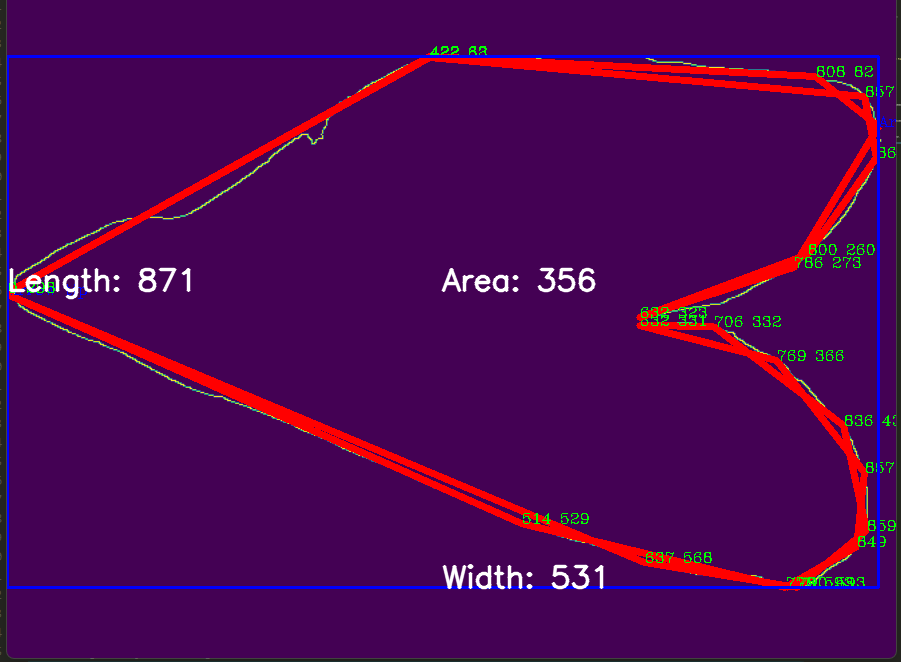
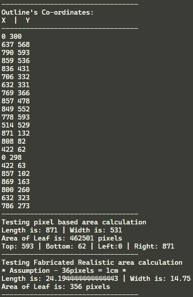

# Current Code

## Basic Info

All images are found in the `images` folder
Most of these images where taken as screenshots from the result of the individual python program
each program is run in a separate, and input is hardcoded into each program
Methods for saving these images still needs to be found

## Description
This is currently how this code works
Images are found below

Begin with `img.jpg` [^1] 
& use with `foreground.py`
output gained from this is `img_foreground.png`

use `foreground_img.png` at `edge.py`
output gained from this is `img_edge.png`

use `img_edge.png` at `contour_co-ordinates.py`

Cooridinates are generated at `contour_co-ordinates.py`
X , Y values are added to lists

Top, Left, Right, Bottom values are generated
using array that has been sorted
```
top = arrY.sort() last value
bottom = arrY.sort() first value
left = arrX.sort() first value
right = arrX.sort() last value
```

Length and Width are then determined
```
width = top - bottom
length = right - left
```

Area is thereafter determined
`area = width * length`

Thereafter console data is displayed & the Rectangle & related text are generated onto image
After all this the final image `img_final.png` is gained

#### Notice

Images are taken from one program to the next
Code still needs to be changed so that only 1 program needs to be used

Correct values still need to be calculated via the ratio
For now the assumption is that 36pixels = 1cm
All Realistic output values are calculated based in this assumption

## Next Steps

Identify separately the calibration cube
This will probably be done using the same methods as seen sovar

Use Main to filter color of calibration cube
Thereafter use foreground then edge then contours to get ratio

or

Use foreground in combination with color of calibration cube to identify only cube
then use edge & contours to get ratio

## Other

Items below are found in the `depreciated` folder, and are currently not being used

| Items |
| ----------- |
| `x_edit_img` is an edited version of `img` <br> 1: Hand has been edited out because better pictures will be taken in the future where hand is not present anymore |
| `x_planning.png` is not currently being used and is a part of `main.py` |
| `x_main.py` is not currently being used |
| `filter_img.png` is the result gained from `main.py` |
| `x_banner.jpg` is used for aesthetic purposes only |

## Images

#### Img.jpg
 <br>

#### Foreground.png
 <br>

#### Edge.png
 <br>

#### Final.png
 <br>

#### Console_Line_Output.png
 <br>

## Important Links

All code was found under --> [GeeksforGeeks](https://www.geeksforgeeks.org/opencv-python-tutorial/)
Easy Markdown --> [Markdown Cheat Sheet](https://www.markdownguide.org/cheat-sheet/)

| More Detailed Links |  |
| --- | --- |
| Draw a line | [GeeksforGeeks](https://www.geeksforgeeks.org/python-opencv-cv2-line-method/) |
| Draw a Rectangle | [GeeksforGeeks](https://www.geeksforgeeks.org/python-opencv-cv2-rectangle-method/) |
| Draw a Text String | [GeeksforGeeks](https://www.geeksforgeeks.org/python-opencv-cv2-puttext-method/) |
| Resizing the Image | [GeeksforGeeks](https://www.geeksforgeeks.org/introduction-to-opencv/) |
| Extracting the RGB values of a pixel | [GeeksforGeeks](https://www.geeksforgeeks.org/introduction-to-opencv/) |
| Reading an image | [GeeksforGeeks](https://www.geeksforgeeks.org/introduction-to-opencv/) |
| `Foreground.py` | [GeeksforGeeks](https://www.geeksforgeeks.org/python-foreground-extraction-in-an-image-using-grabcut-algorithm/) |
| `contours_co-ordinates.py` | [GeeksforGeeks](https://www.geeksforgeeks.org/find-co-ordinates-of-contours-using-opencv-python/) |
| Color Filter | [GeeksforGeeks](https://www.geeksforgeeks.org/filter-color-with-opencv/) |
| `Edge.py` | [GeeksforGeeks](https://www.geeksforgeeks.org/image-processing-in-python/) |
| Blurring | [GeeksforGeeks](https://www.geeksforgeeks.org/python-image-blurring-using-opencv/) |

<center></center>
