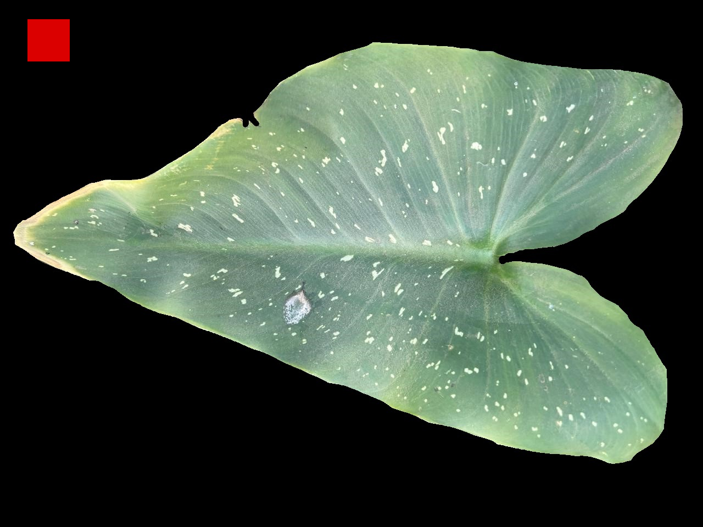
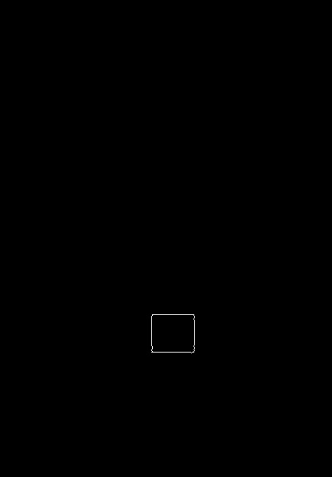
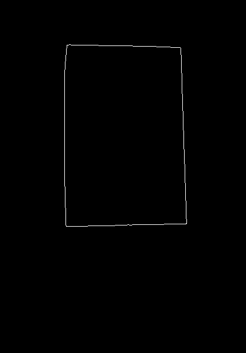
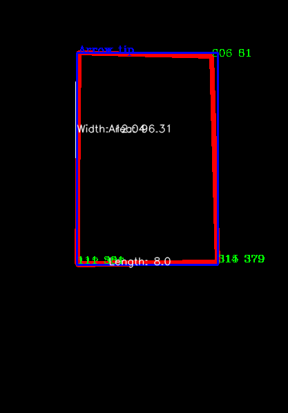

# Current Code

## Basic Info

- Latest is the current code
- Depreciated is old code that is not being use anymore

Code is in a file called `File.py`
Will later on create a JupiterNotebook file once I understand how it works

Please also check the outputs images of the program below
As well as the text file called `output.txt` at `./latest/images/results/output.txt`

## Images

#### Data1
  

#### Data3
  

#### Calibration Cube Filter.jpg
  

#### Edge.png
  

#### Final.png
  

## Important Links

All code was found under --> [GeeksforGeeks](https://www.geeksforgeeks.org/opencv-python-tutorial/)
Easy Markdown --> [Markdown Cheat Sheet](https://www.markdownguide.org/cheat-sheet/)

| More Detailed Links |  |
| --- | --- |
| Draw a line | [GeeksforGeeks](https://www.geeksforgeeks.org/python-opencv-cv2-line-method/) |
| Draw a Rectangle | [GeeksforGeeks](https://www.geeksforgeeks.org/python-opencv-cv2-rectangle-method/) |
| Draw a Text String | [GeeksforGeeks](https://www.geeksforgeeks.org/python-opencv-cv2-puttext-method/) |
| Resizing the Image | [GeeksforGeeks](https://www.geeksforgeeks.org/introduction-to-opencv/) |
| Extracting the RGB values of a pixel | [GeeksforGeeks](https://www.geeksforgeeks.org/introduction-to-opencv/) |
| Reading an image | [GeeksforGeeks](https://www.geeksforgeeks.org/introduction-to-opencv/) |
| Foreground | [GeeksforGeeks](https://www.geeksforgeeks.org/python-foreground-extraction-in-an-image-using-grabcut-algorithm/) |
| Contours co-ordinates | [GeeksforGeeks](https://www.geeksforgeeks.org/find-co-ordinates-of-contours-using-opencv-python/) |
| Color Filter | [GeeksforGeeks](https://www.geeksforgeeks.org/filter-color-with-opencv/) |
| Edge | [GeeksforGeeks](https://www.geeksforgeeks.org/image-processing-in-python/) |
| Blurring | [GeeksforGeeks](https://www.geeksforgeeks.org/python-image-blurring-using-opencv/) |

